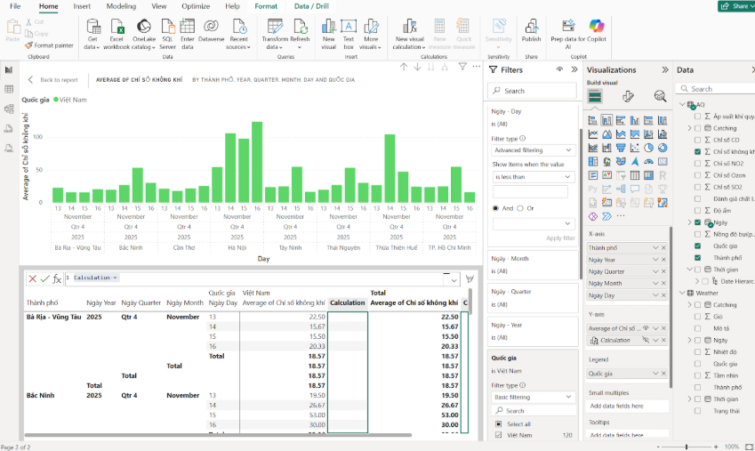

# Hệ thống ETL tự động cho dữ liệu thời tiết và chất lượng không khí

## Giới thiệu
Trong bối cảnh đô thị hóa và công nghiệp hóa mạnh mẽ, ô nhiễm không khí và các hiện tượng thời tiết cực đoan ngày càng ảnh hưởng lớn đến sức khỏe cộng đồng và sự phát triển bền vững của đô thị. Nhu cầu tiếp cận thông tin kịp thời, chính xác về chất lượng không khí và điều kiện thời tiết vì thế ngày càng tăng cao.

Đề tài này tập trung xây dựng một hệ thống ETL (Extract – Transform – Load) tự động nhằm thu thập, xử lý, tích hợp dữ liệu môi trường từ nhiều nguồn khác nhau và chuyển hóa dữ liệu thành thông tin hữu ích, phục vụ người dùng cuối thông qua email và ứng dụng web.

---

## Mục tiêu
- Thiết kế và xây dựng pipeline ETL tự động để trích xuất, làm sạch, chuẩn hóa và lưu trữ dữ liệu thời tiết và chất lượng không khí vào cơ sở dữ liệu tập trung.
- Phát triển cơ chế gửi email định kỳ, cung cấp báo cáo tổng hợp và các chỉ số môi trường giúp người dùng chủ động theo dõi tình hình.
- Xây dựng hệ thống web cho phép người dùng đăng ký dịch vụ, quản lý tùy chọn email và theo dõi trạng thái sử dụng.

---

## Công nghệ sử dụng
- **Python**: Xây dựng các mô-đun thu thập, xử lý và chuyển đổi dữ liệu.
- **Apache Airflow**: Quản lý và tự động hóa pipeline ETL theo mô hình DAG.
- **ClickHouse**: Hệ quản trị cơ sở dữ liệu tối ưu cho phân tích dữ liệu lớn và truy vấn hiệu năng cao.
- **Docker**: Đóng gói và triển khai toàn bộ hệ thống, đảm bảo tính linh hoạt và khả năng mở rộng.
- **ExpressJS**: Phát triển backend API giao tiếp với cơ sở dữ liệu và các dịch vụ.
- **ReactJS**: Xây dựng giao diện người dùng, hiển thị dữ liệu dưới dạng bảng, biểu đồ và dashboard trực quan.

---

## Các chỉ số môi trường chính
- **PM2.5**: Bụi mịn có đường kính ≤ 2.5 µm, ảnh hưởng trực tiếp đến hệ hô hấp.
- **PM10**: Bụi có đường kính ≤ 10 µm, gây kích ứng đường hô hấp và mắt.
- **O₃ (Ozone)**: Ozone tầng thấp, ảnh hưởng tiêu cực đến phổi và hô hấp.
- **CO**: Carbon monoxide, khí độc ảnh hưởng đến tim và não.
- **Áp suất khí quyển**: Liên quan đến các biến đổi thời tiết.
- **Độ ẩm**: Ảnh hưởng đến cảm giác nhiệt và chất lượng không khí.

---

## Tổng quan hệ thống

---

## Triển khai
- Start docker - **docker compose up -d** ( modify password service Clickhouse )
- Start Nodejs - **npm i && npm start**
- Start Reactjs - **npm run dev**

---

## Kết quả thực hiện
- Gửi email tới người dùng: 

-Data trong Clickhouse có thể dùng để phân tích dữ liệu
